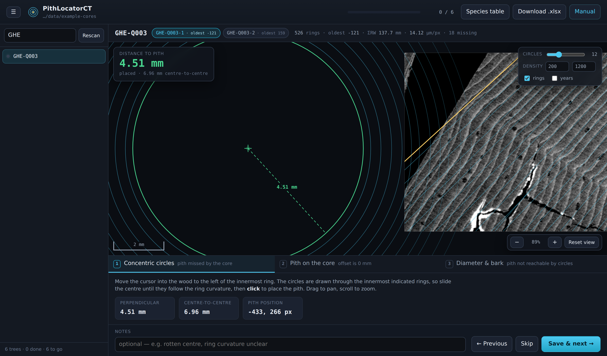

# PithLocatorCT

Measure the distance to the pith on CT cores.

A small local web tool for estimating the distance from the innermost indicated
ring of an increment core to the pith, for cores measured with
[RingIndicator](https://github.com/UGent-Woodlab/RingIndicator).

It reads a folder of RingIndicator output, groups the cores into trees, opens the
core of each tree that reaches furthest back in time, draws the indication lines
over the transverse preview, and writes your estimates to `pith_offsets.xlsx` in
that same folder. Nothing leaves the machine: the server binds to `127.0.0.1`
only.



## Running it

**Windows** — drag the folder with your cores onto `run.bat`, or double-click
`run.bat` and paste the path when it asks.

`run.bat` looks for Python in every sensible place before it does anything else:
a `python\` folder next to the script, the `py` launcher, `python` / `python3` on
PATH, the per-user and all-users install directories, the registry, and the Store
install. Each candidate is checked by *running* it, which is what rejects the
`WindowsApps\python.exe` stub that sits on PATH on many machines and only opens
the Microsoft Store. If nothing works it offers to install Python for you with
`winget` and then finds it without needing a restart.

**macOS / Linux**

```sh
./run.sh /path/to/cores
```

**Any platform, manually**

```sh
pip install -r requirements.txt        # numpy, tifffile, pillow, openpyxl
python pithlocator.py /path/to/cores
```

The browser opens on `http://127.0.0.1:8765/`. Add `--port 9000` to move it,
`--no-browser` to stop it opening a tab. Stop it with Ctrl-C; results are already
on disk. Needs Python 3.8 or newer.

To work through a second folder there is no need to restart: **Open folder…** in
the top bar (or a click on the folder path beside the title) opens your system's
folder dialog and switches to what you pick. Each folder keeps its own
`pith_offsets.xlsx`/`.json`, so results already measured stay where they were
measured, and reopening a folder resumes it where you left off.

## What it expects in the folder

Per core, named after the core stem:

| file | used for |
|---|---|
| `<core>_ring_and_fibre.txt` | ring boundary positions and tilt — **required**, this is what makes a core visible to the tool |
| `<core>_ringwidth.txt` | calendar years, pixel size, accumulated ring width |
| `<core>_Tv.tif` | the transverse preview, windowed to 200–1200 kg/m³ |

## How cores are grouped into trees

Two naming conventions are recognised.

**The usual dendrochronology convention, no separator at all**: a site code and
tree number ending in a digit, then a one- or two-letter core id, then an
optional number if that core was scanned in several **sections**:

| files | tree | cores |
|---|---|---|
| `ABC123A`, `ABC123B` | `ABC123` | `A`, `B` |
| `ABC123A1`, `ABC123A2` | `ABC123` | core `A`, sections `1` and `2` |
| `SHP856A2N1`, `SHP856A2N2` | `SHP856A2` | `N1`, `N2` |

This is only applied when at least one *other* name in the folder confirms it —
some other file's split lands on the same tree. A lone `ABC123A` with nothing
else `ABC123`-shaped in the folder is left whole, because on its own it might
just as well be a complete, unsplit name; splitting it would invent a tree that
doesn't otherwise exist. Once confirmed anywhere in the folder, it is applied to
every name in it, so `TreeID` stays one consistent shape throughout — never
`ABC123` for one tree and `ABC124A` for another in the same output.

**An explicit `-` or `_` separator**, which always wins when present, since it
states outright where the tree name ends:

| files | tree | cores |
|---|---|---|
| `KOR-014-A`, `KOR-014-B` | `KOR-014` | `A`, `B` |
| `KOR-014-A2`, `KOR-014-A3` | `KOR-014` | core `A`, sections `2` and `3` |
| `GHE-Q003-1`, `GHE-Q003-2` | `GHE-Q003` | `1`, `2` |

A tree whose cores are **numbered** can name the sections of one core with a
trailing letter instead — the same three parts in the other order:

| files | tree | cores |
|---|---|---|
| `GHE-F015-1-A`, `GHE-F015-1-B`, `GHE-F015-2` | `GHE-F015` | core `1` in sections `A` and `B`, core `2` |

That shape — letters, digits, letter — is indistinguishable from `KOR-014-A` on
its own, so like the no-separator convention it is only accepted when the folder
confirms it: some other name must split, by the plain separator rule, to the
same tree with a purely **numeric** core token (`GHE-F015-2` above). That is
what says the numbers in this tree are core ids rather than part of the tree
name. Without it the name is left whole, so `KOR-014-A` and `KOR-014-B` stay
cores `A` and `B` of `KOR-014`, and `GHE-F015-1-A` on its own stays a core of a
tree `GHE-F015-1`.

A name matching neither convention is its own tree, which is the safe direction
to fail: the core shows up on its own rather than being filed under a tree it
does not belong to.

**Sections** (`ABC123A1`/`ABC123A2`, `KOR-014-A2`/`KOR-014-A3`, or
`GHE-F015-1-A`/`GHE-F015-1-B`) are pieces of
one physical core that had to be scanned in parts, not separate cores. Case 3
sums their ring width automatically — see below.

The core opened for each tree is the one with the **lowest indicated year**, from
`_ringwidth.txt`. On an equal oldest year the higher section number wins, which
is an arbitrary but stable tie-break; a core that genuinely reaches further back
is opened whatever its number. Cores with no preview image lose to cores that
have one.

Every core of the tree is listed beside the tree name with its oldest year, so
switching to another is one click and nothing is ever hidden.

## The three cases

1. **Concentric circles** (the default). The core missed the pith. Circles are
   drawn around the cursor through each of the innermost indicated rings; line
   the centre up with the ring curvature and click. The saved offset is the
   perpendicular distance from that point to the innermost indicated ring, which
   is the direction in which RingIndicator measures its tilt-corrected ring
   widths. The straight centre-to-centre distance is recorded alongside it.
2. **Pith present and already indicated** — the pith is visible on the core and the
   innermost indication sits on it, so the offset is 0.
3. **Diameter & bark** — for cores that are too short, or whose centre has
   rotted, where no curvature is usable. The offset is

   ```
   D/2 − bark − ΣRW / (1 − Sr)
   ```

   where `ΣRW` is the accumulated indicated ring width of the core and `Sr` the
   total green → oven-dry radial shrinkage of the species. The cores are oven
   dried, so this expands the measured widths back to their green size. The ⌀/C
   button switches the diameter field to circumference.

   If the opened core was scanned in **sections** (see grouping above), `ΣRW`
   sums the ring width of every section by default — a checkbox switches to
   using only the opened section. The panel shows which files went into the
   number, since measuring just one section of a broken core understates `ΣRW`
   and silently inflates the distance to the pith.

## Species and shrinkage

Case 3 needs a species, for its radial shrinkage. Pick it once and it carries to
the next tree, so a folder of one species is chosen once. The bark and diameter
fields are always cleared between trees, because a carried-over diameter would be
both wrong and invisible.

The shipped `Sr` values are the CIRAD Tropix figures for temperate species:

| species | Sr | species | Sr |
|---|---|---|---|
| Abies alba | 0.040 | Pinus radiata | 0.042 |
| Acer pseudoplatanus | 0.045 | Pinus sylvestris | 0.052 |
| Castanea sativa | 0.042 | Pinus uncinata | 0.041 |
| Cedrus atlantica | 0.041 | Populus p.p. | 0.048 |
| Fagus sylvatica | 0.057 | Pseudotsuga menziesii | 0.047 |
| Fraxinus excelsior | 0.057 | Quercus robur/petraea | 0.045 |
| Larix decidua | 0.042 | Thuja plicata | 0.022 |
| Picea abies | 0.039 | Tilia x europaea | 0.050 |
| Pinus pinaster | 0.045 | | |

Every value is editable — **Species table** in the top bar — and edits are kept in
`pith_species_shrinkage.csv` next to the data. Whichever value a measurement used
is written into its row together with its source, so a result always says where
its number came from. A `Source` containing the word *verify* is flagged with a
marker in the dropdown, which is a convenient way to mark a value you are unsure
of.

## Output

`pith_offsets.xlsx` — one row per tree. `Distance_to_Pith_mm` is the column to
merge into your metadata. The remaining columns record how the number was
reached: method, the measured perpendicular and centre-to-centre distances, the
diameter/bark/Sr inputs, accumulated ring width oven-dry and green,
`AccumRW_Files` (which section files went into it, when the core has more than
one), pixel size, the clicked position, and a `Flag` column for results worth a
second look.

`pith_offsets.json` holds the same rows and is what the tool reads on startup to
work out where you left off: restart on the same folder and it reopens at the
first tree with no result yet, ticks the finished ones, and restores a saved pith
click when you revisit one. The `.xlsx` is rewritten from the JSON after every
save, so it is safe to keep the file closed and let the tool own it — if Excel
has it open and the write fails, the tool says so and the JSON is still current.

## Notes

- `.pith_cache/` next to the data holds the rendered previews. Delete it any
  time; it is rebuilt on demand.
- Ring geometry follows `ri.view.RingGeometry` in RingIndicator: a boundary at
  `zpos` with tilt `theta` is the line through `(zpos, (H-1)/2)` with direction
  `(sin θ, cos θ)`. Distances are measured along its normal.
